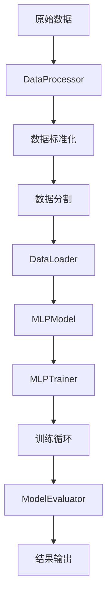

# MLP数值预测模型开发指南

本文档为开发者提供了项目架构说明、扩展开发指导和代码规范，帮助进行高效的二次开发。

## 🏗️ 项目架构分析

### 1. 核心模块架构

```
mlp/
├── 📊 数据层 (Data Layer)
│   ├── data_processor.py      # 数据处理核心
│   ├── NumericalDataset       # PyTorch数据集
│   └── DataProcessor          # 数据预处理管道
│
├── 🧠 模型层 (Model Layer)
│   ├── mlp_model.py           # 模型定义
│   ├── MLPModel               # 核心MLP架构
│   ├── EarlyStopping          # 早停机制
│   └── ModelCheckpoint        # 模型检查点
│
├── 🎯 训练层 (Training Layer)
│   ├── trainer.py             # 训练管理
│   └── MLPTrainer             # 训练器核心
│
├── 📈 评估层 (Evaluation Layer)
│   ├── evaluator.py           # 模型评估
│   └── ModelEvaluator         # 评估器核心
│
└── 🔧 应用层 (Application Layer)
    ├── main.py                # 主程序入口
    ├── example_usage.py       # 使用示例
    └── config.yaml            # 配置管理
```

### 2. 数据流架构



### 3. 类关系图

```python
# 核心类继承和依赖关系
class NumericalDataset(Dataset):
    """PyTorch数据集基类"""
    pass

class DataProcessor:
    """数据处理管道"""
    def __init__(self, config: dict)
    def load_data_from_arrays(self, X, y)
    def normalize_data(self)
    def split_data(self)

class MLPModel(nn.Module):
    """MLP模型核心"""
    def __init__(self, input_dim, output_dim, hidden_layers, ...)
    def forward(self, x)
    def predict(self, x)

class MLPTrainer:
    """训练管理器"""
    def __init__(self, model, config, device)
    def train(self, train_loader, val_loader)
    def predict(self, data_loader)

class ModelEvaluator:
    """评估管理器"""
    def evaluate_model(self, y_true, y_pred)
    def plot_predictions_vs_actual(self, ...)
```

## 🔧 扩展开发指南

### 1. 添加新的模型架构

#### 步骤1：创建新模型类
```python
# 在mlp_model.py中添加
class CustomMLPModel(MLPModel):
    """自定义MLP模型"""
    
    def __init__(self, input_dim, output_dim, custom_param=None, **kwargs):
        super().__init__(input_dim, output_dim, **kwargs)
        self.custom_param = custom_param
        
        # 添加自定义层
        self.custom_layer = nn.Linear(self.hidden_layers[-1], self.hidden_layers[-1])
    
    def forward(self, x):
        # 调用父类的前向传播到最后一个隐藏层
        x = self._forward_to_last_hidden(x)
        
        # 添加自定义处理
        x = self.custom_layer(x)
        x = torch.relu(x)
        
        # 输出层
        return self.output_layer(x)
    
    def _forward_to_last_hidden(self, x):
        """前向传播到最后一个隐藏层"""
        for i, layer in enumerate(self.layers):
            x = layer(x)
            if self.batch_norm and self.batch_norms is not None:
                x = self.batch_norms[i](x)
            x = self._get_activation(x)
            x = self.dropouts[i](x)
        return x
```

#### 步骤2：更新配置支持
```yaml
# 在config.yaml中添加
model:
  type: "custom_mlp"  # 新增模型类型
  custom_param: 0.5   # 自定义参数
```

#### 步骤3：更新模型创建函数
```python
# 在mlp_model.py中修改
def create_model_from_config(config: dict, input_dim: int, output_dim: int) -> MLPModel:
    model_config = config['model']
    model_type = model_config.get('type', 'standard')
    
    if model_type == 'custom_mlp':
        return CustomMLPModel(
            input_dim=input_dim,
            output_dim=output_dim,
            hidden_layers=model_config['hidden_layers'],
            activation=model_config['activation'],
            dropout_rate=model_config['dropout_rate'],
            custom_param=model_config.get('custom_param', 0.5)
        )
    else:
        return MLPModel(
            input_dim=input_dim,
            output_dim=output_dim,
            hidden_layers=model_config['hidden_layers'],
            activation=model_config['activation'],
            dropout_rate=model_config['dropout_rate']
        )
```

### 2. 添加新的数据处理功能

#### 创建数据处理插件
```python
# 创建data_plugins.py
class DataProcessingPlugin:
    """数据处理插件基类"""
    
    def __init__(self, config):
        self.config = config
    
    def process(self, X, y):
        """处理数据的抽象方法"""
        raise NotImplementedError

class OutlierRemovalPlugin(DataProcessingPlugin):
    """异常值移除插件"""
    
    def process(self, X, y):
        from sklearn.ensemble import IsolationForest
        
        # 使用孤立森林检测异常值
        iso_forest = IsolationForest(
            contamination=self.config.get('contamination', 0.1),
            random_state=42
        )
        
        outlier_mask = iso_forest.fit_predict(X) == 1
        
        logger.info(f"移除了 {(~outlier_mask).sum()} 个异常值")
        
        return X[outlier_mask], y[outlier_mask]

class FeatureEngineeringPlugin(DataProcessingPlugin):
    """特征工程插件"""
    
    def process(self, X, y):
        from sklearn.preprocessing import PolynomialFeatures
        
        if self.config.get('polynomial_features', False):
            poly = PolynomialFeatures(
                degree=self.config.get('poly_degree', 2),
                include_bias=False
            )
            X_poly = poly.fit_transform(X)
            logger.info(f"多项式特征工程：{X.shape[1]} -> {X_poly.shape[1]} 特征")
            return X_poly, y
        
        return X, y
```

#### 集成到DataProcessor
```python
# 在data_processor.py中添加
class DataProcessor:
    def __init__(self, config: dict):
        self.config = config
        self.plugins = self._load_plugins()
    
    def _load_plugins(self):
        """加载数据处理插件"""
        plugins = []
        plugin_config = self.config.get('data_plugins', {})
        
        if plugin_config.get('outlier_removal', False):
            plugins.append(OutlierRemovalPlugin(plugin_config))
        
        if plugin_config.get('feature_engineering', False):
            plugins.append(FeatureEngineeringPlugin(plugin_config))
        
        return plugins
    
    def apply_plugins(self, X, y):
        """应用所有插件"""
        for plugin in self.plugins:
            X, y = plugin.process(X, y)
        return X, y
    
    def load_data_from_arrays(self, X: np.ndarray, y: np.ndarray) -> None:
        # 原有逻辑...
        
        # 应用插件
        X, y = self.apply_plugins(X, y)
        
        # 继续原有逻辑...
```

### 3. 添加新的训练策略

#### 创建训练策略插件
```python
# 创建training_strategies.py
class TrainingStrategy:
    """训练策略基类"""
    
    def __init__(self, trainer):
        self.trainer = trainer
    
    def train_epoch(self, train_loader):
        """训练一个epoch的抽象方法"""
        raise NotImplementedError

class AdversarialTrainingStrategy(TrainingStrategy):
    """对抗训练策略"""
    
    def __init__(self, trainer, epsilon=0.01):
        super().__init__(trainer)
        self.epsilon = epsilon
    
    def train_epoch(self, train_loader):
        """对抗训练epoch"""
        self.trainer.model.train()
        total_loss = 0.0
        
        for data, target in train_loader:
            data, target = data.to(self.trainer.device), target.to(self.trainer.device)
            
            # 生成对抗样本
            data_adv = self._generate_adversarial_examples(data, target)
            
            # 正常样本训练
            self.trainer.optimizer.zero_grad()
            output = self.trainer.model(data)
            loss_clean = self.trainer.criterion(output, target)
            
            # 对抗样本训练
            output_adv = self.trainer.model(data_adv)
            loss_adv = self.trainer.criterion(output_adv, target)
            
            # 总损失
            loss = 0.5 * (loss_clean + loss_adv)
            loss.backward()
            self.trainer.optimizer.step()
            
            total_loss += loss.item()
        
        return total_loss / len(train_loader)
    
    def _generate_adversarial_examples(self, data, target):
        """生成对抗样本"""
        data.requires_grad_(True)
        
        output = self.trainer.model(data)
        loss = self.trainer.criterion(output, target)
        
        grad = torch.autograd.grad(loss, data, create_graph=False)[0]
        data_adv = data + self.epsilon * grad.sign()
        
        return data_adv.detach()

class MixupTrainingStrategy(TrainingStrategy):
    """Mixup训练策略"""
    
    def __init__(self, trainer, alpha=0.2):
        super().__init__(trainer)
        self.alpha = alpha
    
    def train_epoch(self, train_loader):
        """Mixup训练epoch"""
        self.trainer.model.train()
        total_loss = 0.0
        
        for data, target in train_loader:
            data, target = data.to(self.trainer.device), target.to(self.trainer.device)
            
            # Mixup
            mixed_data, mixed_target = self._mixup_data(data, target)
            
            self.trainer.optimizer.zero_grad()
            output = self.trainer.model(mixed_data)
            loss = self.trainer.criterion(output, mixed_target)
            loss.backward()
            self.trainer.optimizer.step()
            
            total_loss += loss.item()
        
        return total_loss / len(train_loader)
    
    def _mixup_data(self, x, y):
        """执行Mixup"""
        if self.alpha > 0:
            lam = np.random.beta(self.alpha, self.alpha)
        else:
            lam = 1
        
        batch_size = x.size(0)
        index = torch.randperm(batch_size).to(x.device)
        
        mixed_x = lam * x + (1 - lam) * x[index]
        mixed_y = lam * y + (1 - lam) * y[index]
        
        return mixed_x, mixed_y
```

### 4. 添加新的评估指标

#### 创建自定义评估指标
```python
# 在evaluator.py中添加
class CustomMetrics:
    """自定义评估指标集合"""
    
    @staticmethod
    def concordance_correlation_coefficient(y_true, y_pred):
        """一致性相关系数"""
        mean_true = np.mean(y_true)
        mean_pred = np.mean(y_pred)
        
        var_true = np.var(y_true)
        var_pred = np.var(y_pred)
        
        covariance = np.mean((y_true - mean_true) * (y_pred - mean_pred))
        
        ccc = (2 * covariance) / (var_true + var_pred + (mean_true - mean_pred)**2)
        return ccc
    
    @staticmethod
    def mean_absolute_percentage_error_symmetric(y_true, y_pred):
        """对称平均绝对百分比误差"""
        return np.mean(2 * np.abs(y_true - y_pred) / (np.abs(y_true) + np.abs(y_pred) + 1e-8)) * 100
    
    @staticmethod
    def normalized_root_mean_squared_error(y_true, y_pred):
        """标准化均方根误差"""
        rmse = np.sqrt(np.mean((y_true - y_pred)**2))
        return rmse / (np.max(y_true) - np.min(y_true))

# 更新calculate_metrics函数
def calculate_metrics_extended(y_true: np.ndarray, y_pred: np.ndarray) -> dict:
    """扩展的评估指标计算"""
    basic_metrics = calculate_metrics(y_true, y_pred)
    
    # 添加自定义指标
    custom_metrics = {
        'ccc': CustomMetrics.concordance_correlation_coefficient(y_true, y_pred),
        'smape_custom': CustomMetrics.mean_absolute_percentage_error_symmetric(y_true, y_pred),
        'nrmse': CustomMetrics.normalized_root_mean_squared_error(y_true, y_pred)
    }
    
    return {**basic_metrics, **custom_metrics}
```

## 🎯 开发规范和最佳实践

### 1. 代码风格规范

#### Python代码规范
```python
# 遵循PEP 8规范
# 使用类型注解
def process_data(X: np.ndarray, y: np.ndarray, config: Dict[str, Any]) -> Tuple[np.ndarray, np.ndarray]:
    """
    处理数据的函数
    
    Args:
        X: 输入特征数组
        y: 目标值数组
        config: 配置字典
        
    Returns:
        处理后的X和y
        
    Raises:
        ValueError: 当输入数据格式不正确时
    """
    if X.ndim != 2:
        raise ValueError(f"X应该是2维数组，但得到了{X.ndim}维")
    
    # 处理逻辑...
    return X_processed, y_processed

# 使用dataclass定义配置
from dataclasses import dataclass
from typing import List, Optional

@dataclass
class ModelConfig:
    """模型配置类"""
    input_dim: int
    output_dim: int
    hidden_layers: List[int]
    activation: str = "relu"
    dropout_rate: float = 0.2
    batch_norm: bool = False
```

#### 日志规范
```python
# 统一的日志格式
from loguru import logger

# 信息日志
logger.info("开始训练模型，参数: {}", model_params)

# 警告日志
logger.warning("检测到异常值 {} 个，建议检查数据质量", outlier_count)

# 错误日志
logger.error("模型训练失败: {}", str(e))

# 调试日志
logger.debug("中间结果: shape={}, mean={:.4f}", data.shape, data.mean())
```

### 2. 测试规范

#### 单元测试示例
```python
# 创建tests/test_data_processor.py
import unittest
import numpy as np
from data_processor import DataProcessor, generate_sample_data

class TestDataProcessor(unittest.TestCase):
    
    def setUp(self):
        """测试前准备"""
        self.config = {
            'data': {
                'train_ratio': 0.8,
                'val_ratio': 0.1,
                'test_ratio': 0.1,
                'random_seed': 42,
                'normalize': True
            }
        }
        self.processor = DataProcessor(self.config)
    
    def test_load_data_from_arrays(self):
        """测试从数组加载数据"""
        X = np.random.randn(100, 5)
        y = np.random.randn(100, 2)
        
        self.processor.load_data_from_arrays(X, y)
        
        self.assertEqual(self.processor.input_dim, 5)
        self.assertEqual(self.processor.output_dim, 2)
        np.testing.assert_array_equal(self.processor.X_raw, X)
        np.testing.assert_array_equal(self.processor.y_raw, y)
    
    def test_normalize_data(self):
        """测试数据标准化"""
        X = np.random.randn(100, 5) * 10 + 5
        y = np.random.randn(100, 2) * 20 + 10
        
        self.processor.load_data_from_arrays(X, y)
        self.processor.normalize_data()
        
        # 检查标准化后的数据均值接近0，标准差接近1
        self.assertAlmostEqual(self.processor.X_processed.mean(), 0, places=1)
        self.assertAlmostEqual(self.processor.X_processed.std(), 1, places=1)
    
    def test_split_data(self):
        """测试数据分割"""
        X = np.random.randn(100, 5)
        y = np.random.randn(100, 2)
        
        self.processor.load_data_from_arrays(X, y)
        self.processor.normalize_data()
        
        X_train, X_val, X_test, y_train, y_val, y_test = self.processor.split_data()
        
        # 检查分割比例
        total_samples = len(X)
        self.assertEqual(len(X_train), int(total_samples * 0.8))
        self.assertEqual(len(X_val), int(total_samples * 0.1))
        self.assertEqual(len(X_test), int(total_samples * 0.1))

if __name__ == '__main__':
    unittest.main()
```

#### 集成测试示例
```python
# 创建tests/test_integration.py
import unittest
import tempfile
import os
from main import prepare_data, train_model, evaluate_model, load_config

class TestIntegration(unittest.TestCase):
    
    def setUp(self):
        """创建临时配置文件"""
        self.temp_dir = tempfile.mkdtemp()
        self.config = load_config('config.yaml')
        # 减少训练时间用于测试
        self.config['training']['epochs'] = 5
        self.config['model']['hidden_layers'] = [32, 16]
    
    def test_full_pipeline(self):
        """测试完整的训练和评估流程"""
        # 准备数据
        processor, data_loaders = prepare_data(self.config, data_source="sample")
        
        # 训练模型
        trainer = train_model(self.config, processor, data_loaders, self.temp_dir)
        
        # 评估模型
        results = evaluate_model(trainer, processor, data_loaders, save_plots=False)
        
        # 检查结果
        self.assertIn('test_metrics', results)
        self.assertIn('r2', results['test_metrics'])
        self.assertIsInstance(results['test_metrics']['r2'], float)
    
    def tearDown(self):
        """清理临时文件"""
        import shutil
        shutil.rmtree(self.temp_dir)
```

### 3. 性能监控

#### 创建性能监控工具
```python
# 创建performance_monitor.py
import time
import psutil
import torch
from functools import wraps
from typing import Dict, Any

class PerformanceMonitor:
    """性能监控器"""
    
    def __init__(self):
        self.metrics = {}
    
    def monitor_function(self, func_name: str = None):
        """函数性能监控装饰器"""
        def decorator(func):
            @wraps(func)
            def wrapper(*args, **kwargs):
                name = func_name or func.__name__
                
                # 记录开始状态
                start_time = time.time()
                start_memory = psutil.Process().memory_info().rss / 1024 / 1024  # MB
                
                if torch.cuda.is_available():
                    start_gpu_memory = torch.cuda.memory_allocated() / 1024 / 1024  # MB
                
                # 执行函数
                result = func(*args, **kwargs)
                
                # 记录结束状态
                end_time = time.time()
                end_memory = psutil.Process().memory_info().rss / 1024 / 1024
                
                # 计算指标
                execution_time = end_time - start_time
                memory_usage = end_memory - start_memory
                
                metrics = {
                    'execution_time': execution_time,
                    'memory_usage': memory_usage,
                    'timestamp': time.time()
                }
                
                if torch.cuda.is_available():
                    end_gpu_memory = torch.cuda.memory_allocated() / 1024 / 1024
                    metrics['gpu_memory_usage'] = end_gpu_memory - start_gpu_memory
                
                self.metrics[name] = metrics
                
                logger.info(f"{name} 执行完成: 时间={execution_time:.2f}s, 内存={memory_usage:.2f}MB")
                
                return result
            return wrapper
        return decorator
    
    def get_summary(self) -> Dict[str, Any]:
        """获取性能摘要"""
        if not self.metrics:
            return {}
        
        total_time = sum(m['execution_time'] for m in self.metrics.values())
        total_memory = sum(m['memory_usage'] for m in self.metrics.values())
        
        return {
            'total_execution_time': total_time,
            'total_memory_usage': total_memory,
            'function_count': len(self.metrics),
            'detailed_metrics': self.metrics
        }

# 使用示例
monitor = PerformanceMonitor()

class MLPTrainer:
    @monitor.monitor_function("train_epoch")
    def train_epoch(self, train_loader):
        # 原有训练逻辑...
        pass
```

### 4. 配置管理最佳实践

#### 分层配置系统
```python
# 创建config_manager.py
import yaml
import os
from typing import Dict, Any, Optional
from pathlib import Path

class ConfigManager:
    """配置管理器"""
    
    def __init__(self, base_config_path: str = "config.yaml"):
        self.base_config_path = base_config_path
        self.config = self._load_base_config()
    
    def _load_base_config(self) -> Dict[str, Any]:
        """加载基础配置"""
        with open(self.base_config_path, 'r', encoding='utf-8') as f:
            return yaml.safe_load(f)
    
    def load_experiment_config(self, experiment_name: str) -> Dict[str, Any]:
        """加载实验配置"""
        experiment_path = f"experiments/{experiment_name}.yaml"
        
        if os.path.exists(experiment_path):
            with open(experiment_path, 'r', encoding='utf-8') as f:
                experiment_config = yaml.safe_load(f)
            
            # 合并配置
            merged_config = self._deep_merge(self.config.copy(), experiment_config)
            return merged_config
        else:
            logger.warning(f"实验配置文件不存在: {experiment_path}")
            return self.config.copy()
    
    def _deep_merge(self, base: Dict, override: Dict) -> Dict:
        """深度合并字典"""
        for key, value in override.items():
            if key in base and isinstance(base[key], dict) and isinstance(value, dict):
                base[key] = self._deep_merge(base[key], value)
            else:
                base[key] = value
        return base
    
    def save_config(self, config: Dict[str, Any], save_path: str):
        """保存配置"""
        os.makedirs(os.path.dirname(save_path), exist_ok=True)
        with open(save_path, 'w', encoding='utf-8') as f:
            yaml.dump(config, f, default_flow_style=False, allow_unicode=True)
    
    def validate_config(self, config: Dict[str, Any]) -> bool:
        """验证配置有效性"""
        required_keys = [
            'data.train_ratio',
            'data.val_ratio', 
            'data.test_ratio',
            'model.hidden_layers',
            'training.batch_size',
            'training.epochs'
        ]
        
        for key_path in required_keys:
            if not self._check_nested_key(config, key_path):
                logger.error(f"配置缺少必需的键: {key_path}")
                return False
        
        # 验证数据分割比例
        ratios = [config['data']['train_ratio'], 
                 config['data']['val_ratio'], 
                 config['data']['test_ratio']]
        if abs(sum(ratios) - 1.0) > 1e-6:
            logger.error("数据分割比例之和必须等于1.0")
            return False
        
        return True
    
    def _check_nested_key(self, config: Dict, key_path: str) -> bool:
        """检查嵌套键是否存在"""
        keys = key_path.split('.')
        current = config
        
        for key in keys:
            if not isinstance(current, dict) or key not in current:
                return False
            current = current[key]
        
        return True

# 实验配置示例
# experiments/high_capacity.yaml
"""
model:
  hidden_layers: [512, 256, 128, 64]
  dropout_rate: 0.3

training:
  batch_size: 64
  epochs: 200
  learning_rate: 0.0001
"""

# experiments/fast_training.yaml
"""
model:
  hidden_layers: [64, 32]
  dropout_rate: 0.1

training:
  batch_size: 128
  epochs: 50
  learning_rate: 0.01
"""
```

## 📚 API文档生成

### 自动文档生成
```python
# 创建docs/generate_docs.py
import inspect
import importlib
from pathlib import Path

def generate_api_docs():
    """生成API文档"""
    modules = ['data_processor', 'mlp_model', 'trainer', 'evaluator']
    
    docs = []
    docs.append("# API 文档\n")
    
    for module_name in modules:
        module = importlib.import_module(module_name)
        docs.append(f"## {module_name}\n")
        
        # 获取模块中的类
        for name, obj in inspect.getmembers(module, inspect.isclass):
            if obj.__module__ == module_name:
                docs.append(f"### {name}\n")
                docs.append(f"{obj.__doc__ or '无文档'}\n")
                
                # 获取类的方法
                for method_name, method in inspect.getmembers(obj, inspect.ismethod):
                    if not method_name.startswith('_'):
                        signature = inspect.signature(method)
                        docs.append(f"#### {method_name}{signature}\n")
                        docs.append(f"{method.__doc__ or '无文档'}\n")
        
        docs.append("\n")
    
    # 保存文档
    with open('docs/API.md', 'w', encoding='utf-8') as f:
        f.write('\n'.join(docs))

if __name__ == "__main__":
    generate_api_docs()
```

这个开发指南为您的MLP项目提供了完整的扩展开发框架，包括架构分析、扩展方法、开发规范和最佳实践。通过遵循这些指导原则，您可以高效地进行二次开发和功能扩展。